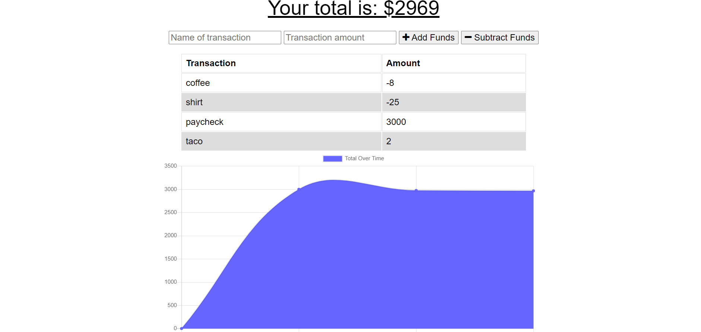

# Budget Tracker

## Description

This application helps the user keep track of their purchases weather they are online or offline. If the user goes offline their entries will be added once they come back online.

## Table of Contents

- [Installation](#Installation)
- [Usage](#Usage)
- [License](#License)
- [Questions](#Questions)

## Installation

You can view the deployed site here

## Usage

The user inputs the name of the transaction and the amount of it. Then the user can either add or subtract the amount to their budget.

## License

MIT

## Questions

For additional information please contact me via GitHub at [https://github.com/codeb-a](https://github.com/codeb-a) or via email at [brandonakers729@gmail.com](mailto:brandonakers729@gmail.com?subject=[GitHub]%README%Generator).
